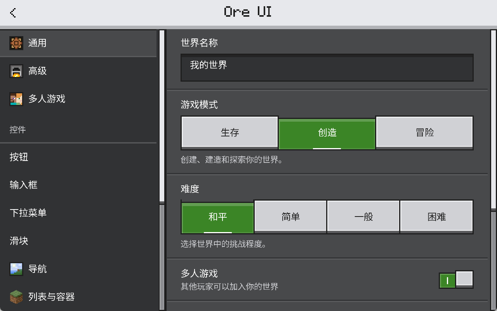
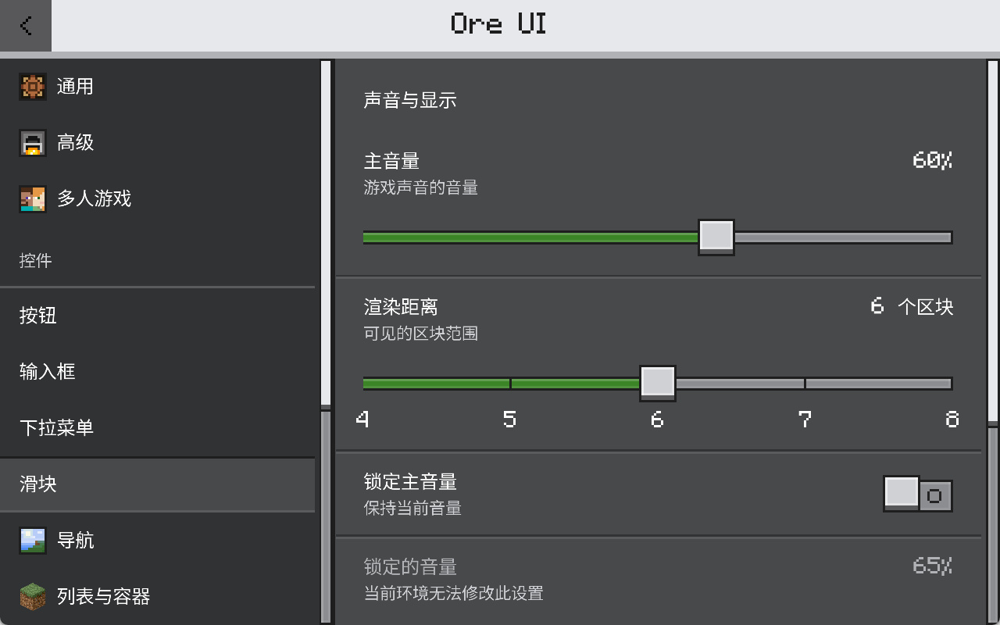
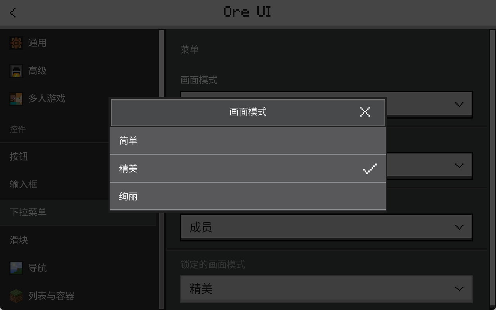
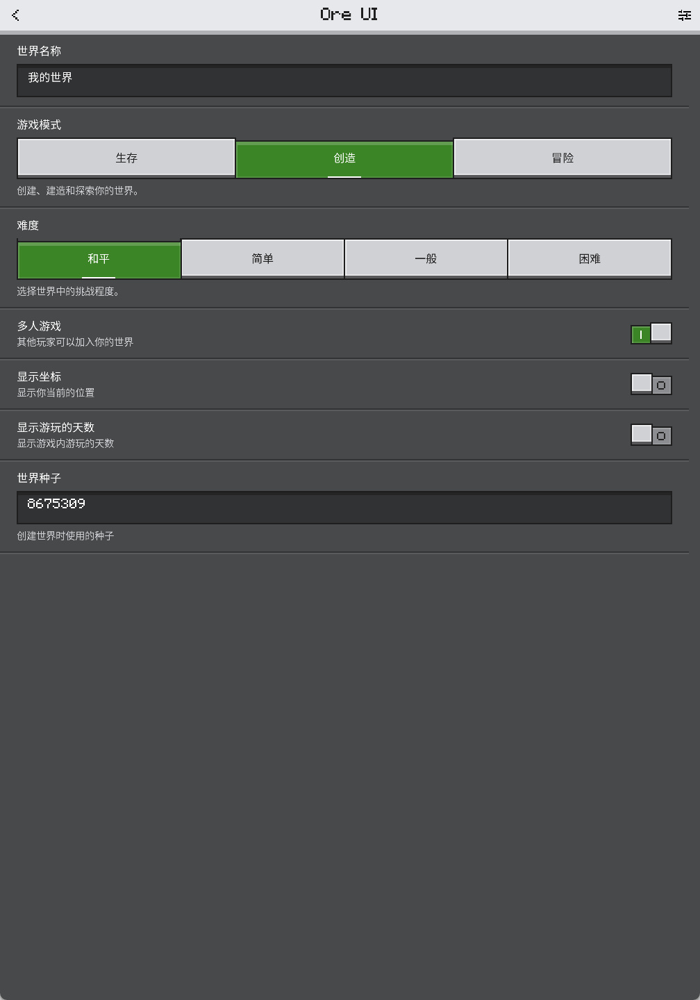

# Pyreact Ore UI

把网易 Minecraft OreUI 3.10 的纹理与主题信息转换成可供其他模组使用的 Pyreact 组件。游戏内代码兼容 Python 2.7，目标环境是**网易基岩版 ModSDK**。

本仓库提供 `oreui/` 组件包和 `resource_pack/textures/pyreact_ore/` 资源。组件复用宿主模组已有的 PyreactMC，不创建第二套运行时；业务状态、导航、布局和事件仍由宿主 Pyreact 管理。



当前版本 `0.1.0` 包含 **589 项去重资源、67 项九宫格元数据、14 项 PNG 序列帧动画**。资源名不依赖 webpack 哈希，来源与转换记录可追溯。按钮包含 primary、secondary、neutral、destructive、realms 五种变体，以及 raised、flat、disabled、显式 focused 状态。

## 接入已有模组

将 `oreui/` 放在客户端包中，与该模组自己的 `pyreact/` 同级：

```text
behavior_pack/
  my_client/
    __init__.py
    pyreact/
    oreui/
    page.py
resource_pack/
  ui/PyreactBase.json
  ui/_ui_defs.json
  textures/pyreact_ore/
```

可以手动复制，也可以使用部署工具。已有模组需先安装 Pyreact 的模板与运行时；工具会保留已有 `_ui_defs.json` 的条目。

```powershell
python -X utf8 tools/deploy.py `
  --client-package 'D:/MyMod/behavior_pack/my_client' `
  --resource-pack 'D:/MyMod/resource_pack' `
  --assets core
```

`core` 包含公共组件使用的控件贴图、图标、键鼠提示与加载动画，适合一般模组。需要全部菜单图片、插画和其余动画时用 `--assets all`。目录查询仍提供完整 catalog，选择 core 后只使用已部署的资源。首次创建没有 Pyreact 的新项目，可以追加 `--pyreact 'D:/Path/To/PyreactMC'`；已有 Pyreact 的项目省略此参数。

在 `my_client/page.py` 中使用：

```python
# -*- coding: utf-8 -*-
from .pyreact import Component, Panel, Style, use_state
from .oreui import OreButton, OreCheckbox, OreCard, OreText, OreVariant


@Component
def SettingsPage():
    enabled, set_enabled = use_state(True)

    def save():
        # 把 enabled 交给你的模组业务。
        print('enabled=' + str(enabled))

    return OreCard(
        style=Style(width=220, padding=10, gap=8),
        children=[
            OreText(content='模组设置'),
            OreCheckbox(value=enabled, onChange=set_enabled),
            OreButton(label='保存', variant=OreVariant.primary, onClick=save),
        ],
    )
```

在宿主客户端完成 `runtime_init`，收到 `UiInitFinished` 后用 `navigator.push(SettingsPage)` 打开。`oreui` 的 import 不负责初始化游戏运行时，也不自行打开页面。完整接入、升级与分发说明见 [INTEGRATION.md](docs/INTEGRATION.md)，参数表见 [API.md](docs/API.md)。

## 组件与资源

| 接口 | 用途 |
| --- | --- |
| `OreButton` | 五种 Ore 按钮，原生悬停/按下，九宫格边框，禁用回调 |
| `OreText`、`OreColors`、`palette_color` | Ore 调色板与默认文字 |
| `OreCard`、`OreListItem` | 卡片与可交互列表项；选中项在 hover/pressed 时保持选中边框 |
| `OreTabs` | 受控页签组 |
| `OreSettingsScreen`、`OreNavigationItem`、`OreSettingsRow` | 设置页框架、灰色目录和双线分隔的设置行 |
| `OreSegmentedControl`、`OreWorldCard` | 带图标的分段选项、世界预览与独立编辑操作 |
| `OreWorldNavigation` | 存档编辑侧栏的世界预览、游戏与 Realms 入口 |
| `OrePackRow`、`OrePackGroup` | 带独立详情与激活动作的资源包列表 |
| `OrePlayerRow`、`OrePlayerGroup` | 玩家头像、在线状态与好友分组 |
| `OreFriendsPanel`、`OreActionMenu` | 可搜索的好友抽屉和玩家操作菜单 |
| `OreCheckbox` | 受控或非受控复选框 |
| `OreSlider` | 受控/非受控滑块，支持拖动与禁用 |
| `OreProgress` | 0..1 进度条 |
| `OreDialog` | 内容自适应弹窗，长正文滚动，背景可关闭 |
| `OreField`、`OreDropdown` | 原生单行输入、受控/非受控下拉菜单 |
| `OreSwitch`、`OreRadio` | 布尔开关与互斥单选 |
| `OreTag`、`OreBadge`、`OreBanner` | 标签、计数与可关闭消息 |
| `OreAccordion`、`OrePagination` | 折叠分组与边界受限分页 |
| `OreScrollView` | 原生滚动；内层列表不撑大外层滚动范围 |
| `OreDrawer`、`OreHelp` | 侧边弹层与点按提示 |
| `OreImage`、`OreIcon` | 普通图片、九宫格资源、图标与序列帧 |
| `asset`、`texture`、`asset_names` | 稳定名字、纹理路径与源尺寸查询 |

这是 Ore 视觉组件库。源包中的 React/webpack 引擎、游戏账户、商城和服务器逻辑不进入运行时。中文使用提前烘焙的 Noto Sans SC Regular，西文使用源包 Minecraft Seven，共 30759 个字形。GIF 保留每帧时间，源文件把时长记为 0 时采用浏览器兼容的 100ms 间隔。字体实现和编辑状态边界见 [TYPOGRAPHY.md](docs/TYPOGRAPHY.md)。

本库继承宿主 Primitive，保留原生点击、拖动、文本编辑和滚动生命周期。部署工具注册 `ui/OreUI.json`，向 `PyreactBase.rootBase` 追加带 `ore_` 前缀的隐藏模板。已有的模板和业务 UI 保留原样。无需编辑宿主 Python 源码，字体测量使用限定于 OreText 的运行时适配。

## 示例与验证

`examples/demo/` 是带 ModSDK 入口的示例源码。默认打开 `settings_playground.py` 的设置测试页，布局使用公共 `OreSettingsScreen`、`OreNavigationItem` 和 `OreSettingsRow`，控件参考国际版 Bedrock 的原尺寸采集。包含 **13 个分区、39 个公共组件**：通用、高级、多人游戏、按钮、输入框、下拉菜单、滑块、导航、资源包、消息、弹窗、资源图鉴、好友。

五种按钮配色、分段选项、双线设置行、带图标页签和完整图像预览都有交互示例。输入和菜单包含空值、禁用、受控与非受控模式，滑块包含连续值和五档整数值。资源包可以分别展开、激活和停用，好友抽屉包含搜索、在线与离线分组及玩家选项。资源图鉴支持检索和翻页，可浏览全部 589 项导入资产与补充参考图标。窄屏改用抽屉目录。旧版图鉴保留为 `LegacyOrePlayground`，其回归记录不代表新版设置页已经通过。

关闭 UI 后按 F11 切换开发客户端的鼠标/触屏模拟，再按 F8 打开测试页。自动回归遵循同样顺序。构建工具在忽略目录中组装完整 Addon：

```powershell
python -m pip install -r requirements-dev.txt
python -X utf8 tools/build_demo.py --pyreact 'D:/Path/To/PyreactMC'
$env:ORE_PYTHON2 = 'D:/Path/To/Python27/python.exe'
python -X utf8 -m unittest discover -s tests -v
```

使用 `.agents/skills/pyreact-debugging` 的受管实例启动构建后的 Addon。准备与调试命令见 [VALIDATION.md](docs/VALIDATION.md)。新版回归入口为 `tools/verify_settings.py --session <session.json> --owner <owner>`，通过技能脚本完成快照、真实鼠标与 F11 模拟触屏输入，并保存业务状态、原生读回和截图证据。国际版参考采集、裁切及像素差分由 `.agents/skills/bedrock-ore-reference` 提供。

验证包含真实 Python 2.7 组件契约、589 项资源校验、实际鼠标输入、关闭 UI 后用 F11 切换的单指模拟，以及逐页截图检查。26 个参考状态使用完整控件比较，保留文字、图标和外围像素，固定端点且容差为零。**当前仍未达到完整控件原像素一致。** 本次结果和截图记录在 [VISUAL_REPAIR.md](docs/VISUAL_REPAIR.md) 和 [validation-latest.json](docs/validation-latest.json)。Android、iOS 硬件、手机输入法和多指操作仍需独立验收。

早期记录使用开发游戏 **3.9.0.401155**。最新按压回归已在 **3.10.0.420447** 建立受管 IPC 连接并执行真实输入，包含列表点击、禁用字段、长按与触屏模拟。组件覆盖和像素差异见 [PRESSED_STATES.md](docs/PRESSED_STATES.md)。交互通过与完整图像逐像素一致分别记录。

新版截图：







新 ZIP 的 Web 目录包含 84 个源码目录（77 个视觉目录、7 个辅助模块）。[reference-coverage.json](docs/reference-coverage.json) 记录源目录映射，不代表所有模块已经移植或逐像素一致。账户、商城、虚拟化列表和游戏手柄焦点导航未自动移植。完整控件当前误差在 [validation-latest.json](docs/validation-latest.json)，早期边框与采集历史保留在 [international-evidence.json](docs/international-evidence.json)。

## 生成与打包

```powershell
python -X utf8 tools/import_assets.py 'D:/Path/To/ORE饼干-3.10.zip'
python -X utf8 tools/package_library.py --assets core
python -X utf8 tools/package_library.py --assets all
```

导入器只读取真实的 `gameplay/assets` 与 `index/assets` 位图。它从 Ore theme module 查询 CSS 切片，转换为 ModSDK 的左、右、上、下顺序；同内容资源按 SHA-256 去重。不会把其他目录里伪装成 `.png` 的 webpack module 当成图像。完整列表见 [assets/manifest.json](assets/manifest.json)。

`dist/` 输出两种 ZIP，供手动复制或部署工具使用，不包含示例世界、MCDK 程序、调试缓存或 Pyreact 运行时。资源权利仍适用下述第三方条款。

## 项目技能与来源

已从用户提供的 PyreactMC、better-building-editor 安装 9 项技能到 `.agents/skills/`：`pyreact-ui-building`、`pyreact-debugging`、`mc-search`、`mod-workflow`、`ffi-cache`、`hash-key`、`next-opt`、`py-except`、`py-init`。重叠的 Pyreact 主技能使用上游通用版本，建筑编辑器专用说明只保留作来源参考。同步记录见 [MCDK_ASSISTANT_UPSTREAM.md](docs/MCDK_ASSISTANT_UPSTREAM.md)。Codex 下一轮对话会发现这些仓库技能。

## 许可

原创组件、适配器、工具与示例代码采用 [MIT License](LICENSE)。导入的 Minecraft/OreUI 资产保留相应权利人的权利；源包没有附开源/再分发许可，本库 MIT 不覆盖这些资产。PyreactMC 依赖适用其自定义 LICENSE/NOTICE，开发技能适用其各自许可。范围、归属和源记录见 [THIRD_PARTY_NOTICES.md](THIRD_PARTY_NOTICES.md)。

本项目使用 PyreactMC 客户端 UI 框架。
