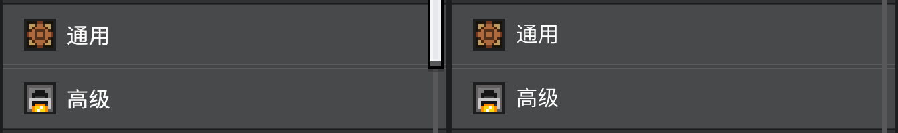
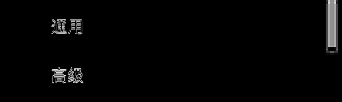
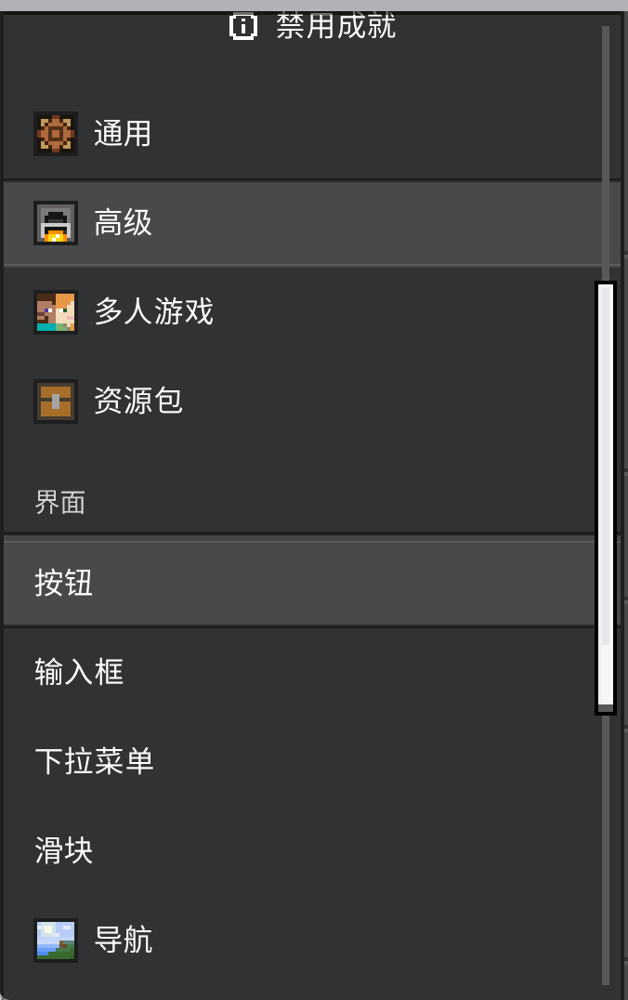

# 导航边缘返工记录

2026-10-05。对应实现提交 `baaea78`。本轮只修复导航选项的边缘、分类分隔线、侧栏边界及侧栏滚动条位置，没有执行全量组件回归。

此前两条未推送的导航修复及随后创建的两条撤回提交已从本地分支历史中移除。本次实现直接接在 `8f63d3f` 后面。

## 修复依据

用户提供的选中项原图包含四条不同颜色的细边。上一版把源贴图的两条内侧颜色删除，留下的两条边仍占用完整逻辑像素，因此没有实现要求的减半。现在保留六行贴图，将上下各两行分别绘制在固定高度为一个 Pyreact 逻辑单位的区域，中间填充独立拉伸。边缘不会随选项高度一起变粗。

在本次测量的四倍 GUI 缩放下，各色带的实际尺寸如下。

| 部位 | 颜色顺序 | 每条颜色的截图像素数 |
| --- | --- | --- |
| 选中项上边 | `#1d1e1f`，`#2b2c2c` | 2，2 |
| 选中项下边 | `#5a5b5c`，`#454647` | 2，2 |
| 未选中项悬停上边 | `#454647`，`#5a5b5c` | 2，2 |
| 未选中项悬停下边 | `#2b2c2c`，`#1d1e1f` | 2，2 |
| 分类分隔线 | `#1d1e1f`，`#454647` | 4，4 |

用户黄色标注的区域来自多余的内侧黑条：它把一列灰色内容隔在边框外。现在去掉这条内侧覆盖物，让完整选项和分隔线延伸到既有右边框。左边框固定不随内容滚动，顶边使用半透明阴影。阴影内的内容滚动后颜色会变化，两端边框仍保持不透明。

侧栏总宽度包含右边框。侧栏滑块与右边框之间保留一个逻辑单位，上下留白各四个逻辑单位。这项位置调整只应用于导航侧栏。

## 游戏内验证

运行实例使用网易开发客户端 `3.10.0.420447`，客户区为 `2016 × 1164`，Pyreact 逻辑尺寸为 `504 × 291`。通过原生鼠标移动和点击采集九张 PNG，并读取原生按钮状态和控件坐标。额外滚动一次验证选中项经过顶边阴影时的颜色。

30 项局部检查全部通过。覆盖选中项默认和悬停、未选中项默认和悬停、两项相邻时的边缘拼接、分类后的第一个选项默认和悬停及选中、分隔线两端、侧栏固定边界、顶边半透明和不透明角点。

边界检查的纵向范围为 `[100, 1148)`。客户区底部 16 个像素包含 Windows 11 窗口圆角，未纳入直线边框断言。完整原始截图仍保留这些像素。最初检查包含圆角时报告的两个失败像素位于 `x=0, y=1154..1155`，不属于导航控件的边缘绘制。

复现局部检查：

```powershell
python -X utf8 tools/verify_navigation_rework.py --session <受管实例的session.json> --owner <实例owner>
```

此命令要求鼠标模式和上述客户区尺寸，只操作导航区域。它不会运行其他测试页的回归。

## 国际版逐像素比对

本轮重新通过 `bedrock-ore-reference` 采集国际版 `1.26.5203.0` 的六种导航状态。国际版客户区为 `2015 × 1144`，测得的控件缩放同样为四倍。采集前显示可用性弹窗，采集结束后调用 `finish`，完成通知在五秒后退出。

完整比对同时包含“通用”和“高级”两行、文字、图标、滚动条，以及四个实际像素的外围空间。原图裁切框为 `[0, 769, 672, 969)`，实际游戏裁切框为 `[0, 804, 672, 1004)`。两者按各自行起点对齐，未缩放、未搜索偏移、未掩盖文字或滚动条。

| 状态 | 完整区域不同像素比例 | 每通道平均绝对误差 |
| --- | --- | --- |
| 通用选中，鼠标移开 | 3.7701% | 4.3324 |
| 通用选中，悬停通用 | 3.7701% | 4.3324 |
| 通用选中，悬停高级 | 3.7693% | 4.2188 |
| 高级选中，鼠标移开 | 3.7693% | 4.3175 |
| 高级选中，悬停高级 | 3.7693% | 4.3175 |
| 高级选中，悬停通用 | 3.7693% | 4.1975 |

完整区域仍未达到逐像素一致。差异图显示残留集中在文字和滑块区域：字体形状仍有差别，两个页面的内容长度不同也使滑块长度不同。这些差异保留在报告中，本轮不将其算作完整控件通过。

补充比较使用同一原图中 `x=[500,600)` 的区域，覆盖两行全部高度及外侧留白。六种状态的该区域均逐像素一致，平均误差和不同像素比例都是零。用户提供的分类分隔线与实际游戏也以相同原始像素比例比较，结果一致。这些是本次边缘修复的证据，不能代替上面的完整控件比较。

原始截图存于 `.runtime/nav-rework`，裁切坐标、原图 SHA-256、30 项检查及完整区域误差记录在 [report.json](images/navigation-rework/report.json)。发布的裁切图片包含完整两行，未删去差异部位。

下面左侧为国际版，右侧为本次实现，状态为“通用选中，悬停高级”：



完整差异图保留文字和滑块的差异：



分类后的第一个选项悬停效果：



运行日志在开始上述回归之前包含一条网易内置 `petSysClient._ShowPetToast` 的 `show_toast` 空对象异常。局部回归期间没有出现导航组件异常。
