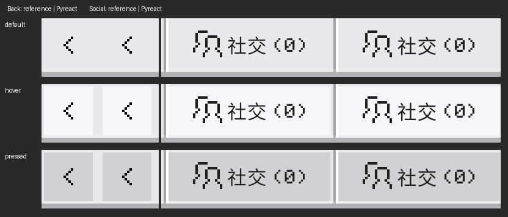

# 页头、拼接边缘与好友页局部修复

本轮只验证页头返回及社交按钮、横向选项拼接、好友图标与滚动切换、世界卡片的预览接缝。没有运行组件全量回归。国际版为 Minecraft for Windows 1.26.5203.0，实际 Pyreact 渲染来自网易 ModSDK 3.10.0.420447。

## 组件库修改

- 新增公共 `OreHeader`，由 `OreSettingsScreen` 使用。表面高 22 个逻辑像素，下沿深度高 2；修正标题基线、返回箭头、社交图标及文字位置。右侧分隔为一条深线和一条白线。
- 返回和社交按钮都提供默认、悬停、持续按下反馈。悬停为 `#f4f6f9`，按下为 `#d0d1d4`。返回按钮的反馈区域为 20×20；社交反馈紧贴分隔白线，右侧保留 0.25 个逻辑像素，在本次比例下为 1 个物理像素。
- `OreTabs` 与 `OreSegmentedControl` 使用共享的 `JoinedRowPrimitive`。小数 flex 宽度曾让相邻九宫格边缘落在不同的栅格位置，选中项上角因此出现突起。现在在原生应用布局时对齐两端的物理像素，同时更新命中矩形，不增加逐帧轮询。
- 纯图标 `OreTabs` 省略空文字及间距，图标等比放在 12×12 区域内。好友、队伍原图的透明边距各有 1 个像素不对称，生成器仅平移画布中的图形，保持原尺寸、不缩放。偏移及来源仍记录在 `assets/reference-icons.json`。
- `OreFriendsPanel` 使用包含 tab 值的滚动 key，切换时直接创建新页的原生滚动实例。长列表的位置与惯性不再传给短列表。
- `OrePlayerGroup` 的标签位于相接横线之上，避免滚动后的共享上沿穿过标签。
- `OreWorldCard` 让预览与名称区域共用一行黑色边框，消除双层边框造成的粗线。

以上均在公共组件或内部适配器中实现，测试页没有另画覆盖层。

## 实际按钮状态

每行依次为默认、悬停、持续按下；每一对的左侧为国际版，右侧为 Pyreact。



两个按钮均检查了物理鼠标持续按住、原生 pressed 可见、第二帧稳定、移出后松开不回调、区域内松开仅回调一次。邻接区域相对默认状态没有改变。采样元数据保留物理按钮状态与持有时长，见各对照 JSON 的 `sources.capture`。

## 像素与行为结果

原生比例为 4 个物理像素对应 1 个逻辑像素。所有数值由原始 PNG 得到，固定半开坐标，无重采样，无位移搜索，容差为零。

| 检查范围 | 结果 |
| --- | --- |
| 返回按钮完整 96×96 裁块，包含箭头及外围留白 | 默认、悬停、按下均为 0 个差异像素 |
| 社交按钮顶部整段边缘、反馈左右边界、分隔线 | 三态均为 0 个差异像素 |
| 社交图标及其周围底色 | 三态均为 0 个差异像素 |
| 整栏底部表面、反光行与下沿深度 | 三态均为 0 个差异像素 |
| 选中项左上接缝的固定 32×40 裁块 | 修改前 60 个差异像素，修改后 0 个 |
| 好友和队伍各自的选中图标及下划线裁块 | 两者均为 0 个差异像素 |
| 世界卡片预览与名称之间的接缝 | 一行黑色接一行反光，指定 32×20 裁块为 0 个差异像素 |
| 好友分组标签与横线的交界 | 滚动位置 0、60、119.75、120 均未出现黑线 |
| 好友与队伍间三次真实点击切换 | 新 tab 的所有已采样滚动位置均为 0，使用不同原生滚动实例 |

选中接缝的局部比较按接缝锚定；完整分段组另按外框锚定。两套坐标公开记录，不能用局部通过替代整组通过。

**完整组件仍不全等。** 社交按钮完整裁块保留文字，默认、悬停和按下分别有 1144、1143、1140 个不同像素，集中于烘焙字形；页头完整表面分别为 2213、2212、2209 个。上下文裁块还保留国际版动态场景与测试背景的差异。完整选项组的字形、键盘提示、个别反光角点仍有差异，相关未遮罩配对图及差分也一并保存。世界预览图内容和高度不相同，因此完整卡片只保留双方原始裁块，不强行缩放后比较。

[机器报告](images/seams-scroll/report.json) 的 `passed` 只对应本轮明确列出的修复断言，65 项均通过；`full_native_exact` 为 `false`。另执行了 4 项已有 Python 2.7 契约测试：页签值绑定、提示按钮循环、分段禁用及图标绑定、导航与分段选中状态。没有运行全量测试。

## 复现

先停止自己持有的游戏实例、确认游戏和 MCDK 进程退出，再部署并冷启动。不要向运行中的实例复制 Python 模块。

```powershell
python -X utf8 tools/verify_seams_scroll.py --session <session.json> --owner <owner> --only friends --output .runtime/seams-scroll/friends-after
python -X utf8 tools/verify_seams_scroll.py --session <session.json> --owner <owner> --only tabs icons --output .runtime/seams-scroll/final
python -X utf8 tools/verify_seams_scroll.py --session <session.json> --owner <owner> --only header --output .runtime/seams-scroll/header-verified
python -X utf8 tools/publish_seams_scroll.py
```

页头标本宽 505.25 个逻辑像素，用至少 2024×1164 的客户区容纳，在截图内保留 2021 像素原宽。该宽度来自国际版采集时的窗口尺寸。返回按钮另一次采集发生在 2020×1156 窗口，左侧局部几何未变。来源尺寸、裁块端点、原图 SHA-256 与采样输入状态在每个 JSON 中记录。

本次冷启动曾遇到 Windows 客户区宽 2024、引擎视口却为 2025 的情况，导致最右侧一列落在预期区域之外。重新调整客户区后两者一致。验证入口现检查引擎逻辑尺寸与视口比例，不满足比例 4 时直接停止。参考技能也补充了同时核对 Windows 客户区及引擎视口的要求。
