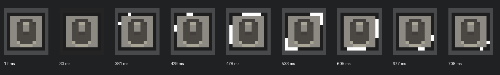
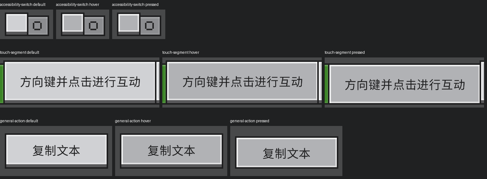

# 设置页点击与图标动画回归

2026-10-06，在网易 3.10.0.420447 的独立实例中复现并修复。改动位于组件库的
`OrePageCache` 和 `OreNavigationIcon`，设置示例无需增加专用点击处理。

## 复现与修复

图标的动画时钟在推进，但静态图标和闪光图像处于同一原生层级，静态图标覆盖了闪光。
修改前对一次真实分类点击录取 49 帧，图标区域只有一种画面。闪光层改为 `zIndex=2`，
位于默认层级为 1 的静态图标上方。保留原来的帧材质、持续时间与选中边沿重播逻辑。

点击问题表现为开关出现 hover、pressed 材质，但业务回调没有收到点击。
重启游戏仍可复现。对照改变原生控件命名时，保留 `accessibility` 为缓存滚动容器的名称前缀，
点击持续失败；改为 `ore_page_accessibility`、`page` 等名称后连续点击成功。
缩短其他节点名称不能修复，较长但不带该前缀的路径也能工作，因此不能归因于路径长度。
这是本客户端上的实测输入路由现象，尚未定位到引擎内部实现。

`OrePageCache` 现在以 `('ore_cached_page', pageKey)` 作为内部稳定键，避免业务页名直接成为
原生容器的名称前缀。逻辑标识保留在 `pageKey` 属性中，激活判断、LRU 顺序和页面状态仍使用
调用者的原始键。元组键也保留不同类型键的区别。调试脚本读取逻辑标识，不再把内部 Fiber 键当成页名。

最终验证使用重新启动的实例和仓库生成的完整资源包，未保留临时命名替换、事件重绑定或层级实验。

## 定向验证

新增 `tools/verify_settings_interactions.py`，只覆盖此次受影响的输入和动画，未运行组件全量测试。
所有点击和长按由真实桌面鼠标投递，脚本不调用 `onClick` 或 `onChange` 代替用户操作。
为了展示普通按钮，测试准备阶段使用 SDK 将通用页滚到末尾；随后仍通过鼠标操作按钮。

32 项检查全部通过，覆盖：

- 可访问性、键盘和鼠标页开关的双向切换，值和原生材质同时变化。
- 返回缓存页后复用原生节点、保留状态，开关仍可反复点击。
- 轻触页分段选项的选择变化，以及禁用操作保持不可用。
- 开关、分段选项和普通按钮的 hover、长按、移出后取消。取消不修改状态，也不打开弹窗。
- 普通按钮松开后打开对应弹窗，弹窗关闭按钮能够关闭它。
- 键盘和轻触图标的实际像素变化，播放结束恢复静态图标，返回键盘页时再次播放。

动画检查以每秒 40 帧录制实际客户区，每次保存 49 张无损图片。自动断言使用图标内部区域，
排除选中背景造成的假阳性。完整边缘录制另外展示了七个非空闪光阶段：



以下是默认、悬停和按住时的游戏实际像素：



另通过 4 项离线契约检查，验证动画重播、稳定缓存键、缓存淘汰、返回时滚动复位和隐藏页面布局规则。
补充的三个缓存分类快速切换测试以每秒 10 次发送 9 次点击，收到 9 次回调并观察到 9 次目标页面提交，
整页布局为 0 次，回调到提交的中位数为 19.2 ms。UI Update 间隔 P95 为 39.6 ms，最大 46.6 ms。
这些时间来自 Python UI Update，不能代替 GPU 帧时间。

本次验证范围是鼠标输入。机器可读记录在 [settings-interactions.json](evidence/settings-interactions.json)，
原始图片和读回数据保存在 `.runtime/interaction-regression/final/`，快速切换记录在同级 `rapid/`。

```powershell
python tools/verify_settings_interactions.py --session <session.json> --owner <owner> `
  --output .runtime/settings-interactions
```

## 对上一轮证据的补充

`NAVIGATION_PERFORMANCE.md` 中的动画帧记录只证明内部帧状态推进。
此前缓存测试通过直接调用 `onChange` 修改值，证明状态保留，但没有验证物理点击是否可达。
上述实际像素录制和物理交互检查用于补足这两个缺口。
